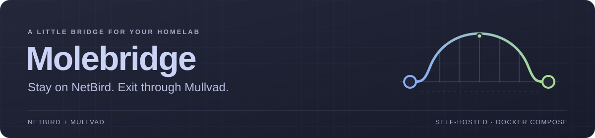
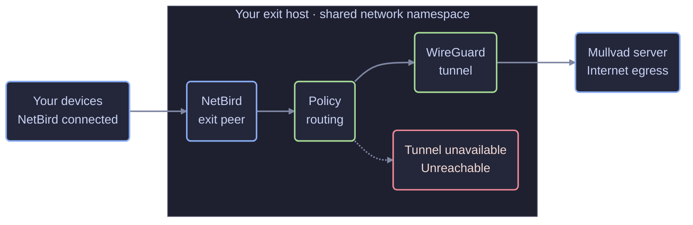

<p align="center">
  
</p>

<p align="center">
  <strong>A small, self-hosted Mullvad exit for your NetBird mesh.</strong><br>
  One Compose project. One Mullvad device. A server picker you can use from your phone.
</p>

<p align="center">
  <a href="docs/setup.md"><strong>Get started</strong></a> ·
  <a href="docs/access.md">Panel access</a> ·
  <a href="docs/architecture.md">Architecture</a> ·
  <a href="https://github.com/irashack/molebridge/actions/workflows/ci.yml">CI</a>
</p>

---

## Your mesh, with a Mullvad exit

On a phone, turning on the Mullvad VPN usually means disconnecting NetBird.
Molebridge moves the Mullvad tunnel to an always-on machine you run. Your devices
stay on NetBird and select that machine as their exit node.

Pick a Mullvad server in the web panel, and every device using the exit follows.
No client reconfiguration when you switch; existing connections through the
exit will drop.

| | What you get |
| :--- | :--- |
| **Stay connected** | Keep NetBird active while sending exit traffic through Mullvad. |
| **Pick your exit** | Browse countries and cities, compare measured latency, and switch servers. |
| **Make it fit** | Embed the panel in a dashboard or install it as a home-screen app. |
| **Keep it small** | Four containers, a Python standard-library panel, and dependency-free front-end code. |
| **See what is happening** | Freshness-aware status, verified egress, and host-side doctor and recovery commands. |

## The traffic path



The exit's own NetBird and Mullvad control connections use its normal network
path. Forwarded client traffic uses a dedicated tunnel table, with unreachable
fallback routes and a terminal routing rule if the table or its lookup disappears.

**The panel stays outside that namespace.** It has no capabilities and writes
only a desired server request. The trusted applier validates the request against
its own Mullvad relay catalogue, updates the live peer, and publishes status for
the panel to read. See the [full architecture](docs/architecture.md) for the
routing and privilege boundaries.

## What you need

You need a container host with Compose (Docker Engine, or rootless Podman with
podman-compose), a NetBird account, a Mullvad account with one free device
slot, and an authenticated way to reach the panel.

1. **[Check the prerequisites](docs/prerequisites.md)** — accounts, host support,
   and NetBird groups and routes.
2. **[Set up Molebridge](docs/setup.md)** — prepare the tunnel configuration,
   enroll the exit peer, and start the containers.
3. **[Verify the exit](docs/verification.md)** — check real client traffic, both
   address families, DNS, and failure behavior before relying on it.

## Know the boundary

| Boundary | What it means for your deployment |
| :--- | :--- |
| **Panel access** | The panel has **no login**. It binds to loopback by default. Use [authenticated access](docs/access.md); anyone who reaches it can change the shared exit. |
| **Routing protection** | The guards protect traffic received by the exit. They are not a device-wide kill switch when NetBird disconnects or the exit is deselected. |
| **Client privacy** | DNS stays under your client and NetBird account configuration. Verify DNS and IPv6 on every client; a healthy server probe cannot prove the whole client path. |
| **Trusted components** | Docker, the host, NetBird, and the applier are privileged. The applier has no config-file mount, but its namespace privileges can retrieve the live WireGuard key. |

Restrict the NetBird exit route to the devices that should use it. Distribution
groups and access policy are covered in the [NetBird prerequisites](docs/prerequisites.md#netbird).

## Project status

**Early, experimental, and still being verified.**

| Where | Verification so far |
| :--- | :--- |
| **macOS / OrbStack** | Apple silicon, self-hosted NetBird 0.78, iPhone and macOS clients. A live pass ran the fail-closed, single-family, orphaned-namespace, status and monitoring drills on the revision before `1390860`; its six findings, including the path-MTU return path for UDP, are fixed in `1390860` through `336d904`. |
| **Automated checks** | On every push: Python regression tests, shell lint, Compose validation, both derived image builds, and isolated Linux IPv4/IPv6 routing failure and recovery drills. Latest results: [View CI](https://github.com/irashack/molebridge/actions/workflows/ci.yml). |
| **Rootless Podman** | Debian 13 / rootless Podman 5.4 / podman-compose 1.6 / amd64, NetBird 0.79, self-hosted. At `5a6e0b5`: all six fail-closed drills with a client held on the exit (no leak during any drill or the reboot), host reboot with unattended recovery, LAN isolation from the client, and the IPv6 path-MTU error leaving through the tunnel. A clean install of the unchanged `compose.yaml` started, passed doctor and survived the documented recovery. Record: [testing](docs/testing.md). |
| **Still unverified** | A live UDP flow larger than the overlay MTU, fail-closed drills with a phone client, and Docker Engine or NetBird Cloud end to end. |

Molebridge is experimental. There are no releases yet; run a pinned revision
and verify it on your own host. Report vulnerabilities privately as described
in [SECURITY.md](SECURITY.md).

## Find your way around

| Guide | Start here when you want to… |
| :--- | :--- |
| [Setup](docs/setup.md) | Install a fresh exit. |
| [Authenticated access](docs/access.md) | Reach the panel through SSH, an overlay policy, or an authenticating proxy. |
| [Operations](docs/operations.md) | Switch servers, embed the panel, upgrade, or recover the stack. |
| [Configuration](docs/configuration.md) | Look up a setting, secret-file location, or state-file format. |
| [Architecture](docs/architecture.md) | Understand routing, catalogue ownership, and privilege separation. |
| [Verification](docs/verification.md) | Test client privacy and deliberately break the tunnel. |
| [Testing](docs/testing.md) | See what has been tested, and validate a new revision on your host. |

<details>
<summary><strong>Working on Molebridge</strong></summary>

The panel uses only the Python standard library, and its front end has no
package dependencies. Start with [AGENTS.md](AGENTS.md) and the
[architecture](docs/architecture.md).

```sh
python3 -m venv .venv
.venv/bin/pip install pytest==9.1.1 PyYAML==6.0.3
.venv/bin/python -m pytest -q panel tools

for script in routing/10-exit-routing routing/wait-for-guards applier/apply.sh tools/check-routing.sh; do
  sh -n "$script"
done
shellcheck -S warning routing/10-exit-routing routing/wait-for-guards applier/apply.sh tools/check-routing.sh
docker compose --env-file .env.example config --quiet
```

On a disposable Linux host, `sudo sh tools/check-routing.sh` exercises forwarding
and failure handling in isolated namespaces without accounts or real endpoints.
These checks complement the real NetBird/Mullvad client drills; they do not
replace them.

</details>

---

Built around [WireGuard's network namespace model](https://www.wireguard.com/netns/).
Molebridge is not affiliated with Mullvad VPN AB or NetBird. The bundled
JetBrains Mono font uses the [SIL Open Font License](panel/static/JetBrainsMono-OFL.txt);
the rest of Molebridge is released under the [MIT License](LICENSE).
