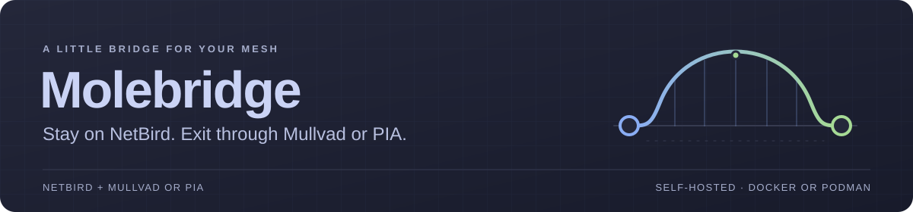
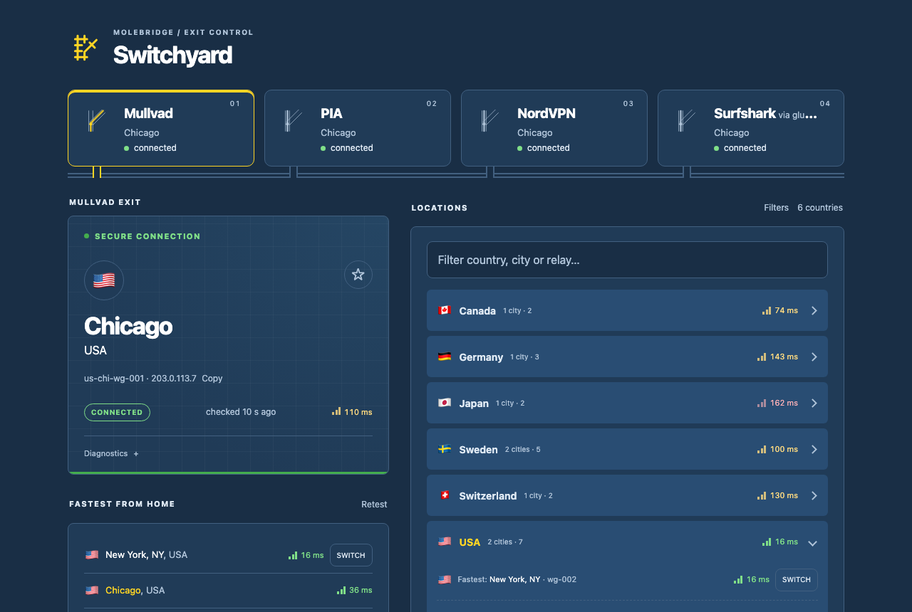
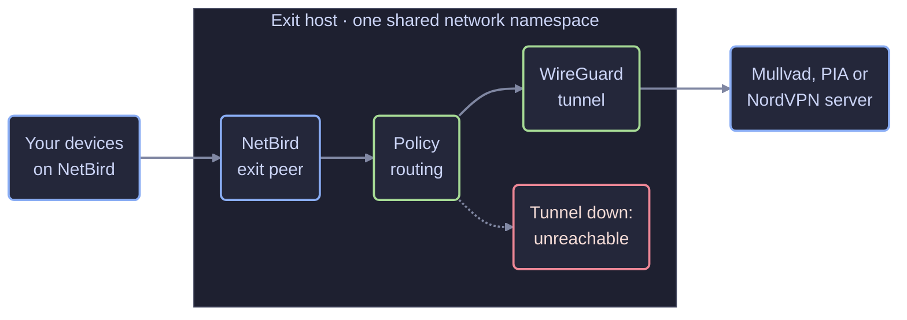

  

  <strong>A self-hosted NetBird exit node that sends traffic through Mullvad, PIA or NordVPN.</strong>

  <a href="docs/setup.md"><strong>Setup</strong></a> ·
  <a href="docs/prerequisites.md">Requirements</a> ·
  <a href="docs/switchyard.md">The panel</a> ·
  <a href="docs/architecture.md">Architecture</a> ·
  <a href="CHANGELOG.md">Changelog</a>

---

Phones can usually run only one VPN at a time, so turning on Mullvad, PIA or
NordVPN means turning off NetBird. Molebridge moves the commercial VPN tunnel onto a
machine you keep running. That machine joins your NetBird network as an exit
node. Your devices stay on NetBird, select the exit, and their Internet
traffic leaves through the VPN provider.

An experimental second backend hands the tunnel to
[gluetun](https://github.com/qdm12/gluetun) instead, which adds FastestVPN,
IVPN, Surfshark and Windscribe.

You choose the server (Mullvad, NordVPN, the gluetun providers) or region
(PIA) in a small web panel called Switchyard. Every device using the exit follows the switch without any client
changes. Alternatively, set [SERVER](docs/configuration.md#a-server-set-in-configuration)
to keep the exit on a configured server; the panel then shows it read-only.
Connections open through the exit drop when it switches.

  

## How it works

```mermaid
flowchart LR
    device("Your devices<br/>on NetBird")
    provider("Mullvad, PIA or<br/>NordVPN server")

    subgraph host["Exit host · one shared network namespace"]
        peer("NetBird<br/>exit peer")
        route("Policy<br/>routing")
        tunnel("WireGuard<br/>tunnel")
        blocked("Tunnel down:<br/>unreachable")
        peer --> route
        route --> tunnel
        route -.-> blocked
    end

    device --> peer
    tunnel --> provider

    classDef endpoint fill:#24273a,stroke:#8aadf4,color:#cad3f5,stroke-width:2px
    classDef routing fill:#24273a,stroke:#a6da95,color:#cad3f5,stroke-width:2px
    classDef stopped fill:#24273a,stroke:#ed8796,color:#f4dbd6,stroke-width:2px
    class device,peer,provider endpoint
    class route,tunnel routing
    class blocked stopped
    style host fill:#1e2030,stroke:#494d64,color:#cad3f5
    linkStyle default stroke:#8087a2,stroke-width:2px
```

Three containers share one network namespace: the WireGuard tunnel, a NetBird
peer, and an "applier" that controls the tunnel. The fourth, the panel, runs
outside it. With the gluetun backend, gluetun owns the namespace and the
tunnel, and a Molebridge "guard" container keeps the same routing rules in
place beside it ([architecture](docs/architecture.md#gluetun-backend)). Traffic forwarded from your devices can only go into the tunnel.
If the tunnel or its routes disappear, that traffic is dropped; it never falls
back to the host's own connection. The exit's own NetBird and VPN control
traffic uses the host's normal route.

The panel holds no VPN credentials, no gluetun control-server key and no
network capabilities, and runs no commands. With OpenID Connect sign-in it
can hold that sign-in's client secret. It writes one file naming the server
you picked. The applier checks that name against the provider's server list,
which it downloads itself (or reads from gluetun), then changes the tunnel
and reports back.

The panel shows an exit as connected only after the applier has checked the
live peer and the address your traffic leaves from. How far that check goes
depends on the provider, and the panel says which one an exit got:

- **provider-confirmed:** the provider itself says the address is theirs.
  Mullvad, PIA and NordVPN, and Mullvad and NordVPN through gluetun.
- **tunnel checks only:** a fresh handshake with the selected server, and the
  address seen through the tunnel differs from the host's own and matches the
  provider's server list where that list gives exit addresses. No provider
  confirms it. FastestVPN, IVPN, Surfshark and Windscribe through gluetun.

Details: [architecture](docs/architecture.md).

## What you need

- **An always-on Linux host**, amd64 or arm64, with kernel WireGuard (Linux
  5.6 or later). Rootless Podman with podman-compose is tested, and so is macOS
  with OrbStack. Docker Engine with Compose 2.24 or later should work but
  hasn't been tested end to end. Windows hosts are not supported.
- **Resources:** on the tested host, a Mullvad exit's four containers use
  about 100 MB of RAM between them, and the images take about 500 MB of
  disk; NordVPN and the gluetun backend haven't been measured. Every byte your
  devices send crosses the host twice, so the host's upload speed caps
  throughput.
- **A NetBird network**, either NetBird Cloud or self-hosted, with admin
  access to create groups, a policy, a setup key and an exit-node route.
- **A VPN account:**
  - Mullvad, which uses one free device slot;
  - or PIA, which needs your username and password on the host;
  - or NordVPN (experimental), whose access token is needed
    only once, at setup;
  - or, through the experimental gluetun backend, an account with one of
    gluetun's providers that Molebridge can select servers for: FastestVPN,
    IVPN, Mullvad, NordVPN, Surfshark or Windscribe.
- **A way to reach the panel with authentication.** Unless you set up
  OpenID Connect sign-in, the panel has no login of its own; see
  [panel access](docs/access.md).
- **Python 3.10 or later on the host**, for the setup and maintenance helpers.

The full list, with the NetBird groups, the outbound ports and the rootless
Podman details, is in [requirements](docs/prerequisites.md).

## Limits

- **The panel has no login unless you configure one.** By default, anyone who
  can reach it can change the exit for every device that uses it. Reach it
  through an SSH tunnel or an authenticating proxy, or turn on
  [OpenID Connect sign-in](docs/access.md#sign-in-with-openid-connect). Sign-in
  has been tried live with one provider and an admin account only; see
  [testing](docs/testing.md#sign-in-pass-at-62a0170).
- **This is not a kill switch on your devices.** The exit fails closed for
  traffic it receives. If a device deselects the exit or NetBird disconnects,
  that device uses its own connection.
- **Molebridge configures no DNS.** Devices keep their own resolvers. With
  Mullvad, plain DNS that passes through the exit ends up at the Mullvad
  server, so a DNS leak test shows Mullvad; this is observed, not documented
  by Mullvad. PIA and NordVPN are untested. See [DNS](docs/operations.md#dns).
- **Mullvad, PIA and NordVPN natively, plus the gluetun backend.** NordVPN
  is experimental: it has had live passes on macOS with OrbStack and on
  rootless Podman, without the client-held fail-closed drills. The
  experimental [gluetun backend](docs/providers.md#the-gluetun-backend)
  selects servers for FastestVPN, IVPN, Mullvad, NordVPN, Surfshark and
  Windscribe through gluetun; only NordVPN has been tried live. Other providers aren't
  supported. Some could be added if there's interest;
  [other providers](docs/other-providers.md) says which, and what that
  support would realistically look like.
- **One provider per exit.** To offer more than one, run one exit per
  provider on the same host and serve them from one
  [Switchyard](docs/switchyard.md#several-exits-in-one-panel).
- **PIA and NordVPN are IPv4 only.** PIA's port forwarding is experimental
  and opens a port to the Internet.
- **No automatic failover.** Molebridge never picks a different server or
  region when one fails. PIA re-registers within the same region when its
  server stops answering, and with gluetun the applier puts your selection
  back after gluetun restarts on another server.
- **NetBird only.** It relies on NetBird's exit-node routes and was never
  built or tested for Tailscale or other overlays.
- **Exits only.** Molebridge carries traffic for NetBird devices, not for
  other containers. To send a container's traffic through a VPN, use
  [gluetun](https://github.com/qdm12/gluetun) directly. Using Switchyard to
  pick the server for an ordinary gluetun container is a
  [roadmap](ROADMAP.md) idea, not built.

## Status

Molebridge is experimental, with one maintainer. Run a release or a pinned
commit, and verify it on your own host before you rely on it. The latest
release is
[v0.5.3](https://github.com/irashack/molebridge/releases/tag/v0.5.3), which
clears a failed switch once its server is live and verified, on top of
v0.5.2's second try for an unanswered egress check, v0.5.1's Switchyard rework
and v0.5.0's NordVPN support and gluetun backend; see the
[changelog](CHANGELOG.md).

| Setup | Tested |
| :--- | :--- |
| Debian 13, rootless Podman 5.4, podman-compose 1.6, amd64, self-hosted NetBird 0.79: Mullvad | A client held on the exit through all six failure drills, a host reboot with unattended recovery, LAN isolation, and a clean install from the published files. |
| The same host: PIA | First start, recreation, a client held on the exit through a tunnel-down drill, IPv6 and LAN isolation, and region switches. |
| The same host: Switchyard | One panel serving the Mullvad and PIA exits, with a selection verified on each. |
| The same host: Switchyard sign-in | Pocket ID v2.16.0: an admin sign-in and a verified switch through it, and the signed-out behavior through a proxy. Sign-in by someone granted only some exits is covered by tests, not yet live. |
| macOS, OrbStack, Apple silicon, self-hosted NetBird 0.78: Mullvad | An earlier live pass; the six defects it found are fixed. |
| CI on every push | Unit tests, shell lint, Compose validation, image builds, and IPv4/IPv6 routing failure drills in isolated namespaces. |
| macOS, OrbStack, Docker, self-hosted NetBird 0.79: NordVPN | Key setup, the server list, switches within a location and to another country, NordVPN-confirmed egress from a client, and IPv6 blocked. |
| macOS, OrbStack, Docker, self-hosted NetBird 0.79: gluetun v3.41.3 with NordVPN | Forwarding from a client with NordVPN-confirmed egress, a server switch, local delivery refused, tunnel down with no client traffic on the host interface, recreation and recovery; also the standalone form without the applier. |
| Debian, rootless Podman 5.8 as Quadlet units: NordVPN | Healthy start with NordVPN-confirmed egress, the namespace checks with a deleted tunnel route, and a phone using the exit on cellular over a direct path. |
| The same host: gluetun v3.41.3 with NordVPN | Healthy start with NordVPN-confirmed egress. No client traffic or switch from the panel yet. |
| Not yet tested | Docker Engine on Linux, Docker Desktop, NetBird Cloud, phones during failure drills, PIA port forwarding against PIA itself, the client-held fail-closed drills for NordVPN, and the gluetun backend with other providers, with client traffic on rootless Podman, or through podman-compose. |

The dated record of each pass is in [testing](docs/testing.md). Report
vulnerabilities privately; see [SECURITY.md](SECURITY.md).

## Documentation

**Install**
- [Requirements](docs/prerequisites.md): accounts, host, NetBird groups and ports.
- [Setup](docs/setup.md): from an empty checkout to a working exit.
- [Verification](docs/verification.md): the checks and failure drills to run before you rely on it.
- [Panel access](docs/access.md): SSH forwarding, an authenticating proxy, or OpenID Connect sign-in.

**Use**
- [Switchyard](docs/switchyard.md): switching, embedding in a dashboard, phones, several exits.
- [Operations](docs/operations.md): health, upgrades, recovery, backups, rootless Podman, removal.
- [Troubleshooting](docs/troubleshooting.md): symptoms and fixes.

**Reference**
- [Configuration](docs/configuration.md): every setting, file and endpoint.
- [Providers](docs/providers.md): how PIA and NordVPN differ from Mullvad, port forwarding, adding a provider.
- [Other providers](docs/other-providers.md): unsupported VPNs, and what adding one would take.
- [gluetun as a NetBird exit](docs/gluetun-netbird-exit.md): gluetun and NetBird with only Molebridge's routing guard, no panel or applier; that form has had one live pass, with NordVPN on Docker.
- [Architecture](docs/architecture.md): routing, trust boundaries and the switching sequence.
- [Testing](docs/testing.md): what has been tested, where and at which revision.
- [Roadmap](ROADMAP.md): ideas that aren't scheduled or built.

Contributions are welcome; see [CONTRIBUTING.md](CONTRIBUTING.md).

---

Molebridge isn't affiliated with Mullvad VPN AB, Private Internet Access,
NordVPN or NetBird. Their names are used only to say what Molebridge works with. The
panel's provider styling uses colors only, with no logos or copied assets.
Molebridge is released under the [MIT License](LICENSE). The bundled
JetBrains Mono font is under the [SIL Open Font License](panel/static/JetBrainsMono-OFL.txt),
and the bundled PIA certificate authority comes with
[PIA's MIT notice](applier/PIA-CA-LICENSE.txt).
