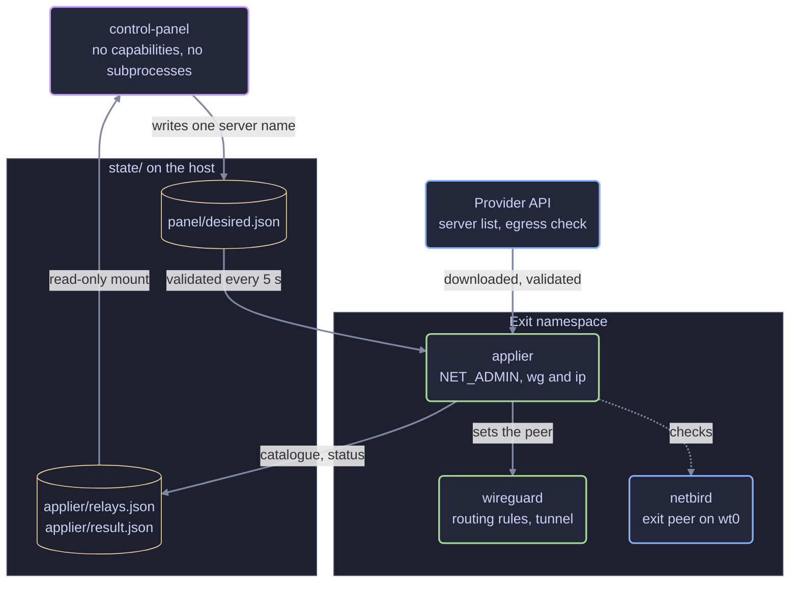
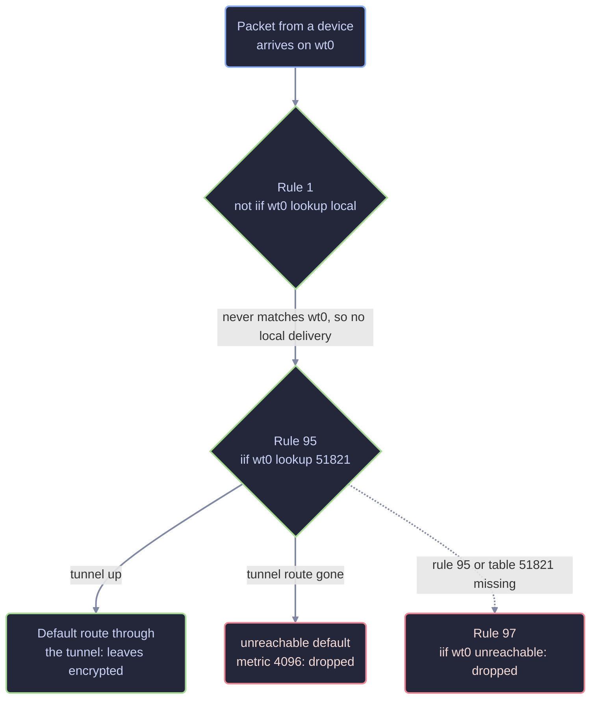
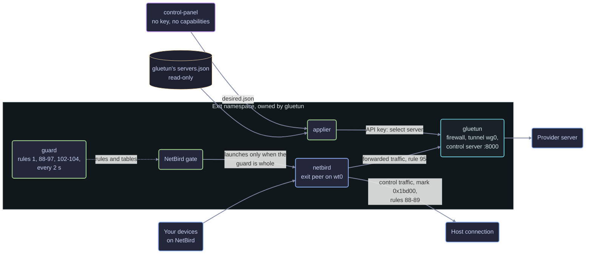
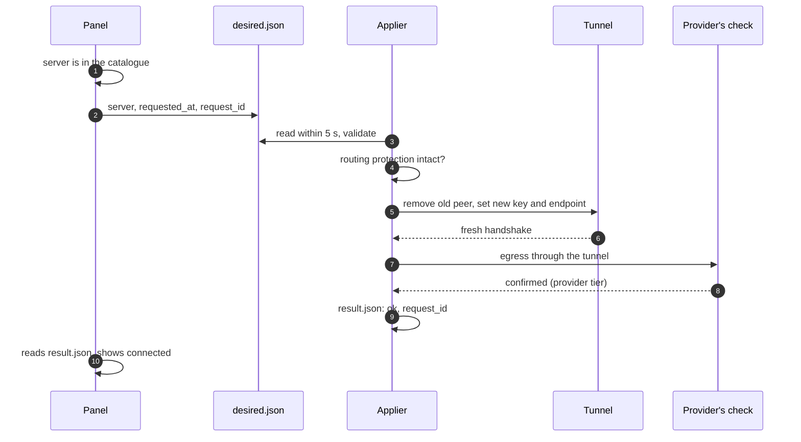

# Architecture

- [Goal and boundary](#goal-and-boundary)
- [Components and trust](#components-and-trust)
- [Routing contract](#routing-contract)
- [gluetun backend](#gluetun-backend)
- [Relay catalogue](#relay-catalogue)
- [Requests and switching](#requests-and-switching)
- [Status reporting](#status-reporting)
- [Panel and access](#panel-and-access)
- [Recovery and verification](#recovery-and-verification)

## Goal and boundary

A device stays on NetBird while the Internet traffic it sends to this exit
leaves through a VPN provider. If the tunnel is unavailable, that forwarded
traffic must fail rather than leave by another path.

There are two backends, and the same promise holds for both:

- **Default** (`compose.yaml`): Molebridge's own WireGuard container owns the
  namespace and the tunnel, for Mullvad, PIA and NordVPN. The sections from
  [components and trust](#components-and-trust) to the
  [routing contract](#routing-contract) describe it.
- **gluetun** (`compose.gluetun.yaml`, experimental): gluetun owns the
  namespace and the tunnel, and a Molebridge guard keeps the routing rules in
  place beside it. [gluetun backend](#gluetun-backend) describes what
  differs.

The applier, the panel, the request and status files, and the
[status reporting](#status-reporting) are shared.

This is a property of the exit's namespace, not of the device. What happens
when a device deselects the exit or NetBird disconnects, and what the device
does with DNS, IPv6 and its own local routes, needs checking separately
([verification](verification.md#from-a-client)).

The sections below describe Mullvad. [Providers](providers.md#how-pia-differs)
lists what differs for PIA and NordVPN. Everything provider-specific is one
entry in the provider registry, `molebridge/providers.py`.

## Components and trust

One Compose project, four containers:

| Container | Runtime | Role |
|---|---|---|
| `wireguard` | Local build from pinned LinuxServer WireGuard | Owns the namespace, installs routing, brings up the tunnel |
| `netbird` | Pinned official NetBird client | Joins the namespace as the overlay exit peer |
| `applier` | Local build from the pinned Python slim base, Debian wg/ip/curl tools | Joins the namespace, owns the relay catalogue, validates requests and controls the peer |
| `control-panel` | Pinned official Python slim | Separate bridge, loopback publish, no capabilities, no subprocesses. Runs as `PANEL_USER` (the host user's uid, or container root mapped to the host user under rootless Podman) |

The panel holds nothing that can change routing: it writes one
file, and the applier decides whether that file names a server it will use.

Build both derived images with `docker compose build wireguard applier`. The
routing script is copied root-owned into the WireGuard image, so the checkout
needs no root-owned directories. Each base is
pinned by multi-architecture digest. Debian tools come from signed package
repositories and may change on an uncached rebuild; rebuild deliberately and
rerun verification. The Docker build context excludes configuration, state and
secrets.

The panel can write only its request directory. It reads `state/applier/`
through a read-only mount. It cannot change the relay catalogue, result or
applier code. An old `state/panel/relays.json` has no authority and is ignored.
Its own outbound connections are the TCP latency probes to relays and, only
when [sign-in](#sign-in) is configured, HTTPS requests to the identity
provider.

The applier never mounts the tunnel config, invokes a shell, or reads a
WireGuard private key. With PIA it also reads the PIA login and sets the
tunnel address on each switch. It does hold `NET_ADMIN` in the tunnel
namespace, so a compromised applier could read the live key and change
routing. It is part of the trusted base, along with the container engine, the
host and NetBird.
Its filesystem is read-only except for its own state and bounded scratch space.

## Routing contract

Initialization first replaces the kernel's priority-0 `lookup local` rule with
the local-delivery guard at priority 1, adding the new rule before deleting
the old one. It then installs temporary IPv4 and IPv6 `iif wt0 unreachable`
rules at priority 80. They block forwarding while the permanent rules are
rebuilt. The temporary rules are removed only after all installation commands
succeed. A readiness marker gates the WireGuard healthcheck and Compose
startup. NetBird's entrypoint also waits, in its own namespace and in both
address families, for the exact priority-97 terminal rule and the priority-1
guard, with no other `lookup local` rule that could match `wt0`, before
launching the official entrypoint. This gate runs even when daemon or host
restarts bypass Compose ordering; [NetBird requirements](#netbird-requirements)
lists what else it refuses. `NB_INTERFACE_NAME` uses the same `OVERLAY_IF` as
routing and the applier.

| Priority | Rule | Purpose |
|---|---|---|
| 1 | `not iif wt0 lookup local` | Replaces the kernel's priority-0 rule. Packets arriving on the overlay are never delivered to a socket on the exit; they fall through to rules 90–97. Loopback and every other interface keep local delivery. |
| 90 | `iif mullvad to <overlay range> lookup main` | Tunnel replies return over the overlay. Client-originated traffic cannot use this exception. |
| 94 | `from <tunnel address> ipproto icmp lookup 51821` | ICMP errors the exit generates for tunnel traffic (fragmentation needed, packet too big) return through the tunnel. With the tunnel route gone they hit the unreachable fallback, never the host's default route. IPv6 uses `ipproto ipv6-icmp`. |
| 95 | `iif wt0 lookup 51821` | Forwarded traffic uses the exit table. |
| 96 | `oif mullvad lookup 51821` | Interface-bound health probes use the same table. |
| 97 | `iif wt0 unreachable` | Terminal guard if lookup 95 or all exit-table routes disappear. |
| — | `unreachable default metric 4096 table 51821` | Fallback when the tunnel route is absent. |

A forwarded packet, one that arrived from a device on `wt0`, meets the rules
in priority order and stops at the first that decides:

Replies from the provider come back in on the tunnel and reach the device
through rule 90. Nothing in this path falls through to the main table, which
holds the host's default route.

IPv6 uses the same contract. Rule 90 is omitted for IPv6 when no IPv6 overlay
range is configured. Rule 94 exists for each family that has a tunnel address:
initialization reads the `Address` line of the tunnel config, the same file
`wg-quick` uses, so the rule can exist before the interface does. Exactly one
IPv4 address and at most one IPv6 address are supported. Table numbers 0–255
are reserved and refused. Interface names, overlay ranges and tunnel addresses
are validated.

The overlay link is narrower than the tunnel (NetBird 1280 bytes, Mullvad
1420), so replies larger than the overlay MTU need an ICMP error back to their
origin. NetBird clamps TCP; UDP, including QUIC, depends on that error. The
error is generated by the exit itself, so no `iif`/`oif` rule matches it; only
its source address does. The protocol qualifier holds the rule to that one
purpose: an unqualified rule would force every protocol sourced from the
tunnel address into the tunnel, including traffic from anything else sharing
the namespace. `compose.yaml` sets
`net.ipv4.icmp_errors_use_inbound_ifaddr=1` so IPv4 errors carry the tunnel
address; the kernel already selects the inbound interface's address for IPv6.
Without rule 94 the errors would leave over the host's route with an
unroutable source, and large UDP flows through the exit would silently stall.

### NetBird requirements

Rule 1 means overlay traffic is never delivered to the exit itself. A packet
arriving on `wt0` for one of the exit's own addresses, on the overlay or the
host side, is routed like any other forwarded packet, into the tunnel, or it
hits the terminal guard. The exit's own addresses become ordinary
destinations, which the LAN isolation check in
[verification](verification.md#from-a-client) already covers. Loopback and
every other interface keep local delivery.

Molebridge requires NetBird to run with kernel WireGuard and its kernel
firewall, and supports only NetBird's daemon mode, its default profile and the
settings listed in [configuration](configuration.md#env):

- `compose.yaml` sets `NB_DISABLE_USERSPACE_ROUTING=true`.
- The entrypoint gate refuses to launch NetBird when
  `NB_DISABLE_USERSPACE_ROUTING` is not true, or when
  `NB_FORCE_USERSPACE_FIREWALL`, `NB_FORCE_USERSPACE_ROUTER`,
  `NB_USE_NETSTACK_MODE` or `NB_WG_KERNEL_DISABLED` is.
- The applier's health check and the host doctor fail unless the overlay
  interface is a kernel WireGuard link and NetBird's kernel firewall is in
  place (its `netbird` nftables table, or its `NETBIRD-` chains through
  iptables-nft). With kernel WireGuard, NetBird uses its kernel firewall or
  does not start.

Rosenpass, NetBird SSH, DNS nameservers and domain routes are not supported on
the exit peer; leave them off for its groups
([requirements](prerequisites.md#netbird)). Rosenpass's key exchange needs
local delivery from the overlay, so the gate refuses to launch NetBird when
`NB_ENABLE_ROSENPASS` is set or a stored NetBird profile has
`RosenpassEnabled`.

The guards name `OVERLAY_IF`, and NetBird uses the interface its stored
profile names. The gate therefore supports only NetBird's default profile at
its default location: it refuses `NB_CONFIG`, `WT_CONFIG`, `NB_PROFILE`,
`WT_PROFILE` and an active profile other than `default`, and refuses a default
profile whose `WgIface` differs from `OVERLAY_IF`. The NetBird image has no
JSON tool, so the gate carries a small JSON reader in POSIX awk. It validates
the whole file and reads only the root object's own fields, matching names in
any ASCII case as Go's decoder does; it refuses a checked field that appears
twice and a root field name outside printable ASCII. Other fields may hold
anything. The [configuration](configuration.md#env) page lists exactly what it
refuses. The host doctor runs the same checks in the running container.

These NetBird settings were checked against the 0.79.0 source, the release
Molebridge pins; a NetBird upgrade needs them checked again.

The tunnel uses `Table = off`. Its `PostUp` adds a default route through
`mullvad` to the exit table; `PreDown` removes it. The fallback and terminal
guard are not removed on tunnel down. The exit's own unbound traffic continues
through the ordinary route so NetBird and Mullvad control traffic can connect.
The applier checks, on every pass:

- the overlay interface exists, is a kernel WireGuard link, and NetBird's
  kernel firewall is in place;
- every rule has the expected priority and selectors, and no `lookup local`
  rule other than rule 1's form could match the overlay interface;
- both fallback routes are present;
- the exit table has no route through another interface;
- in each family with a global tunnel address, there is a tunnel default and
  a return-path rule for exactly that address and its ICMP protocol;
- the ICMP source sysctl is set.

An IPv4-only tunnel still needs the IPv6 fail-closed guards, and must have no
IPv6 return-path rule. An unknown rule ahead of the guard, an extra selector,
or a leftover temporary guard means the result can't be healthy.

Sharing the namespace has one consequence for NetBird itself: by default it
gathers ICE candidates on every interface it finds there, including the exit
tunnel. A candidate on that interface can never complete a STUN exchange, and
NetBird can advertise the tunnel address to peers as a candidate. The exit
interface therefore belongs in the peer's ICE blacklist. `compose.yaml` sets
it for the first enrollment through `NB_EXTRA_IFACE_BLACKLIST`; after that the
peer's stored configuration wins, so an already enrolled peer needs the
`netbird up --extra-iface-blacklist` flag, and the host doctor reads the
stored field because no `netbird` command prints it. See
[setup](setup.md#5-keep-ice-off-the-tunnel-interface).

A privileged actor can remove or bypass these protections. Health polling
detects drift; it is not an instantaneous defense against a compromised host.

## gluetun backend

**Experimental.** Live passes with NordVPN on Docker and on rootless
Podman; see [testing](testing.md#gluetun-backend-pass-at-a3bb14f) for what
they covered and what they didn't. Everything below was also read in the source of the
pinned releases (gluetun v3.41.3, NetBird 0.79.0), exercised in isolated
namespaces by `tools/check-routing.sh` (routing, guard and gate) and covered
by unit tests against fakes (the applier). Without the applier and the panel,
the guard and gate alone make a smaller setup:
[gluetun as a NetBird exit](gluetun-netbird-exit.md).

With this backend [gluetun](https://github.com/qdm12/gluetun) owns the
provider tunnel instead of Molebridge, which brings its provider list. Only
gluetun's WireGuard providers are supported. Molebridge keeps the same
promise: traffic forwarded from your devices leaves only through the tunnel,
and is dropped when the tunnel or its routes are gone.

### Containers

`compose.gluetun.yaml` replaces `compose.yaml` (set
`COMPOSE_FILE=compose.gluetun.yaml`; the settings are in
[configuration](configuration.md#gluetun-backend)).

| Container | Image | Role |
|---|---|---|
| `gluetun` | Pinned `qmcgaw/gluetun` v3.41.3 | Owns the namespace, its firewall and the tunnel interface (`EXIT_IF`, kernel WireGuard) |
| `guard` | The routing image from `compose.yaml` | Joins the namespace, installs the rules below and keeps them in place; `NET_ADMIN` only |
| `netbird` | Pinned official NetBird client | Joins the namespace; starts only through the gate, which stays its parent |
| `applier` | The applier image from `compose.yaml` | Joins the namespace; reads gluetun's server list, selects servers through gluetun's control server and verifies the result |
| `control-panel` | Unchanged | Shows the provider's name with "via gluetun" |

gluetun's control server listens on the namespace's loopback only, port 8000,
and is never published. Its role file (`secrets/gluetun/auth.toml`) gives
one role exactly five routes, `PUT /v1/vpn/settings`, `GET /v1/vpn/status`,
`GET /v1/publicip/ip`, and `GET` and `PUT /v1/updater/status`, with an API key; with any role in the file gluetun
answers no other route. Without the file gluetun would apply a public
default role that includes `PUT /v1/vpn/status`, so `compose.gluetun.yaml`
binds it in a way that makes Compose fail when it is missing. gluetun logs
a role file it can't decode with an excerpt of the offending line, which
could include the key, so gluetun starts through `routing/gluetun-preflight`,
which accepts only the exact file `gluetun-auth` writes and refuses
anything else with a fixed message, on every start and restart.

**The API key is full gluetun administration.** gluetun authorizes by route
and method only, and `PUT /v1/vpn/settings` accepts any VPN setting: keys,
addresses, the provider, command hooks. Whoever holds the key controls the
tunnel. The applier holds it as part of the trusted base, as it holds
`NET_ADMIN` in the namespace, which already lets it read the live WireGuard
key and change routing. Only gluetun (in its role file) and the applier
mount it; the panel never does. The applier never calls `GET
/v1/vpn/settings`, which returns the WireGuard private key, and refuses to.

### Why the guard is policy routing

gluetun routes every locally generated packet that lacks its own mark into
its tunnel: rule 101, `not fwmark 51820 lookup 51820`. That includes
NetBird's control traffic (management, signal, relays, STUN and the
WireGuard socket), which must use the host's connection. gluetun's firewall
drops forwarding by default, but NetBird inserts its own `FORWARD` accepts,
so the firewall can't be what keeps forwarded traffic in the tunnel. The
guard therefore sits in policy routing, ahead of gluetun's rules 98–101 and
NetBird's 105 and 110, both address families:

| Priority | Rule | Purpose |
|---|---|---|
| 1 | `not iif wt0 lookup local` | The [local-delivery guard](#netbird-requirements), replacing the kernel's priority-0 rule. |
| 80 | `iif wt0 unreachable` | Temporary, while the rules are first installed. |
| 88 | `iif lo fwmark 0x1bd00/0xffffffff lookup 51822` | NetBird's control traffic uses the host table. `iif lo` limits it to packets the exit itself sends, and the exact mark leaves out NetBird's data-plane marks (0x1bd10–0x1bdff), so no forwarded packet can match. |
| 89 | `iif lo fwmark 0x1bd00/0xffffffff unreachable` | Control traffic with no host route fails here instead of reaching rule 101 and the tunnel. |
| 90 | `iif wg0 to <overlay range> lookup main` | Tunnel replies return over the overlay. |
| 91 | `iif lo to <overlay range> lookup main suppress_prefixlength 0` | What the exit itself sends to the overlay, above all the ICMP errors it returns to clients (fragmentation needed, packet too big, unreachable), uses NetBird's overlay route in the main table. `suppress_prefixlength 0` ignores main's default route, so only a route to the overlay counts. Without this rule those errors would reach gluetun's rule 101 and go into the tunnel, and path MTU discovery for clients would fail. |
| 92 | `iif lo to <overlay range> unreachable` | With no overlay route (NetBird down, `wt0` gone), that traffic fails here instead of reaching rule 101 and the tunnel. |
| 94 | `from <tunnel address> ipproto icmp lookup 51821` | ICMP errors the exit generates for tunnel traffic return through the tunnel, or hit the fallback. Follows the address gluetun gives the interface. |
| 95 | `iif wt0 lookup 51821` | Forwarded traffic uses the exit table. |
| 96 | `oif wg0 lookup 51821` | Interface-bound probes use the same table. |
| 97 | `iif wt0 unreachable` | Terminal guard if rule 95 or the exit table's routes disappear. Without both, a forwarded packet carrying gluetun's mark 51820 would skip rule 101 and leave by the main table; the namespace drill shows it. |

`wg0` stands for `EXIT_IF`, `0x1bd00` for `CONTROL_MARK`, 51821 for
`EXIT_TABLE` and 51822 for `HOST_TABLE`. Rules 90–92 exist for each family
with an overlay range. The guard owns priorities 0–97 and 102–104 in this
namespace and removes anything else it finds there; 102–104 are
[below](#the-exits-own-traffic-rules-102104). The default backend has no rules 91
and 92: without gluetun's rule 101, the exit's own traffic to the overlay
already reaches the main table and NetBird's overlay route.

**Exit table** (51821): the permanent `unreachable default metric 4096`
fallback, and `default dev wg0` while the interface is up with an address
in that family. Not gluetun's table 51820: when gluetun's table is empty,
traffic would fall through to later rules instead of the fallback.

**Host table** (51822): copies of the main table's default and on-link
routes through `HOST_IF`, the namespace's interface toward the host, and
nothing else, so never a route through the tunnel. It is a separate table
so that rule 88 does not depend on the main table being complete in each
family. An empty IPv6 host table is fine on a host without IPv6; NetBird's
IPv6 control traffic then fails at rule 89.

### The reconcile loop

gluetun deletes and recreates its interface on every reconnect, health
restart and settings change, and the kernel drops the routes through it.
The guard therefore keeps running, as its own container, and every
`ROUTING_RECONCILE_INTERVAL` seconds (2 by default):

- puts back the exit table's tunnel route once the interface is up again,
  and rule 94 for its current address; until then forwarded traffic hits the
  fallback;
- refreshes the host table when the main table's host routes change;
- checks every rule in 0–97 in both families, adds a missing one and removes
  any other. The expected rules and tables are defined once, in
  `routing/gluetun-rules`, which the gate reads too. A wrong rule whose selectors are a subset of the right one's
  could take the right one with it when deleted, so that priority is rebuilt
  behind a copy one priority earlier. The fallback route and the correct
  rules 1 and 97 are never removed otherwise;
- writes the readiness marker only when every rule and route is in place,
  including an IPv4 host default route, and removes it otherwise. Readiness
  doesn't depend on the tunnel being up;
- writes `wg show wt0 fwmark` to a file the gate reads (the NetBird image
  has no `wg`), every 2 seconds whatever the reconcile interval, stamped with the kernel's boot id and its boot clock
  (`/proc/uptime`), which changes to the wall clock don't move.

### NetBird's control mark and the gate

Rules 88 and 89 only see marked packets. NetBird marks its sockets with its
control mark only when its advanced routing is on; with it off, its control
traffic is unmarked and reaches rule 101, the tunnel. In gluetun mode the
gate in front of NetBird's entrypoint (`routing/wait-for-guards`, with
`TUNNEL_BACKEND=gluetun`) therefore also:

- refuses to start NetBird when `NB_USE_LEGACY_ROUTING`, `NB_SKIP_SOCKET_MARK`
  or `NB_DISABLE_CUSTOM_ROUTING` is true, or when `NB_FWMARK_BASE` differs
  from `CONTROL_MARK` (NetBird 0.79.0 honors that variable;
  `compose.gluetun.yaml` sets both from `CONTROL_MARK`);
- waits, in both families, for the whole guard, judged by the same
  definitions the guard itself uses (`routing/gluetun-rules`, mounted into
  the NetBird container next to the gate): every rule in the table above
  that applies, exactly, including 102–104, and nothing else at
  priorities 0–97 or 102–104; the exit
  table's fallback and no route in it but the tunnel default; and a host
  table equal to the main table's host routes, with an IPv4 default. An
  early rule such as `iif wt0 lookup main` at priority 50, or a host route
  in the exit table, keeps NetBird from starting;
- then stays in front of NetBird instead of handing over, and stops it, so
  the container exits with status 1 and the restart policy and health show
  it, when NetBird's log shows `advanced routing has been requested to be
  disabled` or `system doesn't support required routing features, falling
  back to legacy routing`; when `wg show wt0 fwmark` hasn't been the control
  mark for 30 seconds, counted on the boot clock from launch or from when
  the last good record was written (rereading the same record doesn't
  extend it, and a record from another boot or from the future counts for
  nothing); or when
  any part of that guard stays missing or wrong for 30 seconds.

**The accepted residual.** The settings above are checked before launch, so
only a failed capability check inside NetBird can leave its control traffic
unmarked. NetBird runs that check at startup: it fails if setting the socket
mark, a loopback UDP dial, a deadline or a write fails, or if a test `ip
rule` add fails. All of these are local loopback and netlink operations in a
namespace where NetBird holds `NET_ADMIN` and gluetun's own rule 101 already
relies on socket marks. NetBird can sign in to management before its overlay
interface exists, so the gate can't wait for the fwmark before launching.
If the check does fail, NetBird's own TLS and relay connections go through
the provider tunnel until the gate sees the log line, or at most 30 seconds
until the missing fwmark stops NetBird. That is an availability and
metadata cost for NetBird's control traffic, not a leak of your devices'
traffic: rules 1, 95 and 97 hold forwarded traffic throughout. The 30 seconds
are the grace period, not a hard ceiling: the gate checks every two seconds,
and once it decides to stop NetBird it allows up to 20 seconds for NetBird to
exit before killing it. Closing this
gap would need a per-process identity for NetBird inside the shared
namespace (a uid or cgroup to match on), which costs more than the gap.

### gluetun's firewall

gluetun sets DROP policies and its own accepts at startup, then runs
`/iptables/post-rules.txt` once. `python3 tools/molebridge.py
gluetun-post-rules` writes that file from your settings: `FORWARD` accepts
from `wt0` to the tunnel and for established replies back, an `OUTPUT`
accept for everything leaving by `HOST_IF`, and an `INPUT` accept for
NetBird's WireGuard port, in IPv4 and IPv6. These let the exit work; they
are not the guard. A line that fails stops gluetun, including every
`ip6tables` line when gluetun found no working ip6tables; generate the file
with `--ipv4-only` on such a host. gluetun doesn't rerun post-rules after
its in-process VPN restarts, which don't clear them either.

The `OUTPUT` accept can't name NetBird's control mark. To remove its own
rules, as it does on every reconnect, gluetun lists the whole `INPUT` or
`OUTPUT` chain and parses every line, and its parser knows only the targets
`ACCEPT`, `DROP`, `REJECT` and `REDIRECT` and the matches for a TCP or UDP
destination port and a connection state (`internal/firewall/list.go` at
v3.41.3). A mark match, or a jump to a chain of Molebridge's own, makes it
fail, and its old accepts pile up; an earlier version of these rules did
exactly that. So the accept covers the whole host interface, like gluetun's
own accept for its tunnel interface, and the kill switch for the exit's own
traffic is in policy routing instead: rules 102–104.

### The exit's own traffic: rules 102–104

gluetun's kill switch for traffic the namespace itself sends is its
firewall, and it doesn't hold through a reconnect: when gluetun empties its
tunnel table, or removes rule 101 while it restarts the VPN, unmarked local
traffic falls through to the main table and the host's default route, and
gluetun's own `OUTPUT` accept for established connections lets existing
flows out (seen on a test exit: gluetun's DNS-over-TLS connections left by
the host interface just after the tunnel went down). The guard therefore
adds, in both families, between gluetun's rule 101 and NetBird's 105:

| Priority | Rule | Purpose |
|---|---|---|
| 102 | `iif lo fwmark 0xca6c lookup main` | gluetun's WireGuard socket, which carries mark 51820 (0xca6c, fixed in gluetun v3.41.3) and which rule 101 skips, reaches its server by the main table. |
| 103 | `iif lo lookup 51822 suppress_prefixlength 0` | The host interface's own subnets: the host table's on-link routes, never its default. |
| 104 | `iif lo unreachable` | Anything else the exit sends that rule 101 didn't take into the tunnel fails: new and established flows of gluetun (DNS, health checks, updates, public IP) and of other processes in the namespace. |

Rule 103 is needed at gluetun's start. gluetun adds `default via <gateway>
dev eth0 table 200` (its inbound routing) before its own rule 98 for local
subnets exists, and the kernel checks the gateway with a route lookup that
passes the policy rules as locally generated traffic. Without rule 103 that
lookup reached rule 104, the kernel refused the route with "network is
unreachable", and gluetun stopped; this happened on a test exit during
`recover`. The guard therefore fills the host table first and adds rule 104
only once rule 103 and the host table are in place; until then it reports
the kill switch as held back and isn't ready.

What still uses the host's connection is what is meant to: NetBird's
marked control traffic (rules 88 and 89), gluetun's WireGuard socket (102),
traffic to the host's local subnets (103, and gluetun's rule 98), replies from the
host's own address (gluetun's rule 100), and loopback and the exit's own
addresses (rule 1's local lookup, including Docker's DNS at 127.0.0.11).
The applier's probes are bound to the tunnel interface (rule 96) or carry
the control mark. NetBird's unmarked DNS lookups now go into the tunnel or
fail, instead of using the host while gluetun reconnects. Forwarded traffic
never matches `iif lo`.

### The applier with gluetun

The applier works as it does with the default backend ([requests and
switching](#requests-and-switching)); these parts differ.

**Catalogue.** gluetun's own server list, not a download: gluetun keeps it
in `servers.json` (`STORAGE_FILEPATH`), which `compose.gluetun.yaml` puts in
a volume of its own so the applier can mount only that directory,
read-only. The file is untrusted. The applier reads it with the same limits
as a download (32 MiB, no symlinks, duplicate keys refused), keeps only
the configured provider's WireGuard servers with a valid key, hostname and
IPv4 endpoint, and keeps the last good catalogue when the file fails to
parse, as it does while gluetun rewrites it in place. It checks the file
every minute and reads it again when it changed, or at least every six
hours. gluetun dates each provider's data when it last changed; the panel
and the doctor show that date and call the data stale after 30 days.
gluetun's updater refreshes it every `GLUETUN_UPDATER_PERIOD` (24 hours by
default), first one period after gluetun starts, so a fresh install would
list gluetun's built-in data, which is from 2024 for NordVPN in v3.41.3.
The applier therefore starts one refresh itself (`PUT /v1/updater/status`)
once gluetun's VPN is running and its tunnel has had a handshake in the
last 150 seconds (gluetun reports running while it still tries servers that
don't answer), when the data is older than the period or than 7 days: at most three tries per applier start, each given 15 minutes,
reported as `server_list_update` in `result.json`. gluetun's updater
fetches the provider's public list from gluetun's own process, so through
the tunnel, and doesn't restart the VPN; for Surfshark and FastestVPN it
also resolves every server name. Only providers whose servers one gluetun filter selects exactly
are offered: FastestVPN, IVPN, Mullvad, NordVPN, Surfshark and Windscribe,
all by hostname. AirVPN and ProtonVPN repeat hostnames and names across
servers, and gluetun's custom provider has no list.

**Switching.** The applier sends `PUT /v1/vpn/settings` setting gluetun's
hostname filter to the selected server and clearing every other server
filter. gluetun then restarts its VPN in-process: its interface disappears
and comes back, and the guard puts the exit route back within a couple of
seconds. The applier reports that as switching, not as a failure, for up to
90 seconds. Success needs, as with the default backend: exactly one peer
whose endpoint and key identify the selected server in the catalogue (`wg
show wg0 endpoints`, IPv4 or IPv6, matched against every address the
server lists, since gluetun connects to any of them at random; an address
listed for several servers stays unidentified), a fresh handshake, the whole guard in both families
(including rules 88, 89, 91 and 92 and the host table), and egress
confirmation at the provider's [tier](#status-reporting): Mullvad's
`am.i.mullvad.net` and NordVPN's `ips/insights` through the tunnel, using
the same code as those native providers; the tunnel checks for the others.

**The host's own address.** The tunnel checks compare the address seen
through the tunnel with the host's own. In gluetun's namespace every socket
without gluetun's mark goes into the tunnel (rule 101), so the applier
measures the host's address over HTTPS from a socket carrying NetBird's
control mark: rule 88 sends it to the host table, and the post-rules accept
it on `HOST_IF`. Setting a socket mark needs `NET_ADMIN`, which the applier
holds.

**gluetun restarting.** Settings put at runtime are lost when gluetun
restarts; it starts again from `GLUETUN_SERVER_*`. The applier keeps the
server it last put and the last one it verified in
`state/applier/gluetun-selection.json`. A request from the panel that was
accepted is put again by the usual path whenever the live server differs
from it. When there is no such request, or the last one was refused, and
gluetun runs a server other than the one last put, the applier puts the
last verified one again. It waits until gluetun's peer can be identified,
and never within 90 seconds of its last selection.

### Startup and recovery

`gluetun` starts first and enables its firewall; `guard` starts once
`gluetun` has started and becomes healthy when its rules are in; `netbird`
waits for that, and its gate checks again by itself, also on daemon or host
restarts that ignore Compose's ordering; `applier` starts with `netbird`.
Restarting or recreating `gluetun` creates a new namespace: recreate the
others with it, with `python3 tools/molebridge.py recover` on Docker, which
knows this file.

gluetun runs its own DNS server in the namespace by default, which resolves
over the tunnel, and points its own container's resolver at it. On Docker
with OrbStack, at `4933360`, NetBird in the namespace resolved names through
it, so through the tunnel ([testing](testing.md#gluetun-backend-at-4933360-and-the-standalone-form));
so with the tunnel down it would not reach management by name. Other
engines haven't been checked.

## Relay catalogue

With the default backend, the applier downloads the catalogue; with gluetun
it reads gluetun's file instead ([the applier with
gluetun](#the-applier-with-gluetun)). The applier fetches the fixed HTTPS
Mullvad relay API at startup and every six hours. Redirects and proxy environment overrides are refused. Input is size
limited, decoded as JSON with duplicate keys rejected, and checked for active
WireGuard entries, hostname shape, canonical 32-byte base64 keys, IPv4 endpoints
and bounded location strings. The optional display attributes (Mullvad-owned,
RAM-only, hosting provider) are kept only when they are strict booleans or
bounded text; they never affect whether a relay may be selected.

The PIA catalogue is PIA's region list, and the NordVPN catalogue NordVPN's
server list, each parsed and validated the same way by its own module; see
[providers](providers.md). Each provider's download limits are in its registry
entry: 10 MiB and 20 seconds, except NordVPN's 32 MiB and 60 seconds.

It atomically writes `state/applier/relays.json`. Failed or empty refreshes
keep the last good catalogue and publish a sanitized error in
`relay-error.json`; retries happen every minute. A catalogue older than 24
hours cannot authorize a new switch or a healthy result. It does not remove a
working tunnel merely because the API is unavailable.

## Requests and switching

1. The panel checks membership in the read-only catalogue and atomically writes
   `desired.json` with `server`, `requested_at` and a random `request_id`.
2. Every five seconds the applier reads a bounded, regular, non-symlink file.
   It validates the entire schema and resolves the name only through its own
   fresh catalogue. The old two-field request schema remains readable.
3. Before changing a peer it verifies routing protection. It removes old peers
   and aborts if removal fails, then applies the approved key/endpoint using
   fixed subprocess argument lists and timeouts.
4. It probes Mullvad through the tunnel for up to roughly 60 seconds. Success
   requires a fresh non-future handshake, separate typed Mullvad egress responses
   from `curl -4` against `ipv4.am.i.mullvad.net` and (for an IPv6 tunnel)
   `curl -6` against `ipv6.am.i.mullvad.net` (`am.i.mullvad.net` itself has no
   AAAA record), and intact routing protection.
   The current server is derived from live peer
   state, including the initial server from the downloaded configuration.
5. An unavailable fresh catalogue, overlay interface or tunnel routing leaves
   the request pending without changing peers. The applier reports the missing
   prerequisite and retries the same request when prerequisites recover.
   A malformed or unlisted request, or a switch that fails, is acknowledged
   as failed and not retried. Selecting the same server again creates a new
   request. A failed switch whose requested server is nonetheless the live
   one (PIA's automatic re-registration refused while the tunnel it meant to
   repair recovers by itself, or a switch whose verification timed out
   before the tunnel came up) is reported as failed by at least one check,
   then cleared by the first later check that finds that server live and
   passing every check. No other server is selected automatically. After normal
   tunnel recreation, a previously successful desired selection is reapplied.

A failed health probe does not necessarily mean traffic is blocked: a working
approved tunnel can carry traffic while the verification endpoint is unavailable.
A failed switch remains visibly failed until a new request or process
restart, unless a later check finds the requested server live and verified,
as above.
Routing protects against a missing tunnel; probe failure does not install an
alternate route.

## Status reporting

Every roughly 60 seconds the applier writes a new `result.json`. The panel and
API use the same status interpretation. A missing, malformed, future-dated or
more-than-150-second-old check is unknown, even if the file says `ok`. Requests
must be acknowledged by ID before their outcome is displayed. Failed browser
polls immediately clear the connected indication. Last-check diagnostics are
explicitly historical.

A result counts as connected only with intact routing protection, NetBird in
kernel mode, a fresh handshake, the live peer matching a fresh catalogue
entry, and confirmed egress. Egress is confirmed at one of two tiers, recorded
in `result.json` as `egress_tier`:

- **`provider`**: the provider's own endpoint says the request arrived over
  its VPN (Mullvad's `am.i.mullvad.net`, PIA's status call), for every address
  family the tunnel carries. `exit_confirmed` is true exactly when this tier
  is reached, as before tiers existed.
- **`tunnel`**: for a provider without such an endpoint. Every family the
  tunnel carries needs a fresh handshake; two independent IP echo services,
  asked through the tunnel interface, answering with the same address; that
  address differing from the host's own public address, measured off the
  tunnel; and, where the catalogue
  lists exit addresses for the selected server, the address being one of
  them. A measurement that fails, after the one retry described below,
  fails the tier.
  The one exception is IPv6 when the namespace shows independently that it
  has no IPv6 of its own: no IPv6 route in any of its tables except the
  tunnel's, the overlay's, refusing (unreachable and the like), link-local,
  multicast and loopback ones, and no global IPv6 address on any interface
  but the tunnel and the overlay, loopback included. Then
  there is no host IPv6 address to confuse with the tunnel's. `exit_confirmed`
  stays false. The panel shows the exit as connected
  with a "tunnel checks only" label. The checks are in
  `molebridge/egress.py`.

The tier a provider can reach is fixed in its registry entry
(`molebridge/providers.py`). A provider with its own check is never accepted
at the `tunnel` tier, so a result claiming it does not count as connected.
Every native provider has its own check. With the [gluetun
backend](#gluetun-backend), Mullvad and NordVPN keep theirs, and FastestVPN,
IVPN, Surfshark and Windscribe reach only the `tunnel` tier. The `tunnel`
tier is covered by unit tests only. `egress_tier` is null while egress is
unconfirmed.

Each egress request goes through the tunnel with a 10-second limit. When a
health check's egress check gets no usable answer (a timeout, a refused or
reset connection, an HTTP error, a malformed reply or, at the `tunnel` tier,
a failed measurement of the host's own address), the applier waits 10
seconds and asks once more before it reports a failure. An answer that does
not confirm the egress (`mullvad_exit_ip: false` for any family, PIA's
`connected: false`, NordVPN's `protected: false` beyond its cache retry, or
echo answers that fail the `tunnel` checks) counts at once and ends the
check before any further request, so a later timeout can't turn it into a
retry: asking again would only delay reporting traffic that may be leaving
the wrong way. There is no second attempt while a switch is verified, because
the switch keeps asking until its own timeout; when the check fails whatever
the answer (no fresh handshake, a pending request or a failed one that the
check can't clear, a peer not in a fresh catalogue); or when the first attempt took longer than 15 seconds.
The second attempt starts no request more than 30 seconds after it began,
and NordVPN's cache retry stops waiting then too, so a check that retries
ends within about 70 seconds. Routing protection, NetBird's mode and the peer
count are checked before any egress request and fail at once; a missing or
stale handshake fails the check after the first attempt, without a second.
Until the check finishes, the previous result stays in `result.json`, and
readers still treat one older than 150 seconds as unknown; only a check that
passed writes `ok`. The applier logs `applier: egress check got no answer;
asking once more`, and `applier: egress check got no answer twice` when the
second attempt fails too.

`/healthz` checks panel liveness. `/readyz` returns 200 only for a fresh,
verified connected result, at either tier; otherwise 503. Docker's applier healthcheck checks
freshness, a live WireGuard exit interface with exactly one peer, current
routing protection, and NetBird on kernel WireGuard with its kernel firewall,
after a completed inspection; startup
and an in-progress switch do not count as completed checks. It does not restart unhealthy
containers. The host-side doctor additionally checks the shared namespace and
recent verified egress.

## Panel and access

Unless [sign-in](#sign-in) is configured, there is no application login.
Loopback publishing plus authenticated access is required; see
[access](access.md). Every request must name a published host:
loopback or an entry of `PANEL_PUBLIC_HOSTS`; anything else receives 421 before
status or a token-bearing page is served, so a DNS-rebinding page reaching the
loopback publish learns nothing (`/healthz` answers before this check). POSTs
require a cookie-bound CSRF token, and an `Origin` header, when the browser
sends one, must name a host from the same list. The request's own `Host` and
`X-Forwarded-Host` are never used as the allowlist, because a rebinding page
controls them.
Security headers restrict scripts/styles/resources to same origin,
and dashboard framing is opt-in. HTTP body size and socket time are bounded.
Remote text is escaped in HTML and assigned as text in JavaScript.
Panel logs use fixed route names and omit client addresses, origins, query
strings, bodies and unknown paths.

One panel can serve several exits on the same host (`PANEL_EXITS`; see
[Switchyard](switchyard.md)). Each exit is a pair of state directories under
`$STATE_DIR/<id>`. Every request names its exit, and a selection is checked
against that exit's own catalogue and written only to that exit's
`desired.json`. The privilege split is unchanged: each applier alone applies
what its own request file asks.

Latency probes remain unprivileged TCP connects to port 443, cached for 15
minutes, with bounded concurrency. They run only for open pages and measure the
host-to-relay path, not end-to-end client latency. One request names at most
256 servers, a country at most 128 of them (a fixed sample when it has
more). The panel runs one latency request per exit and four in all, answering
429 beyond that before it loads anything; no lock is held while probing, and
a server already being probed is waited for rather than probed again.

### Sign-in

Sign-in is optional and off unless `PANEL_OIDC_ISSUER` is set; without it the
panel has no login. The setup is in [access](access.md#sign-in-with-openid-connect).
It is OpenID Connect's authorization code flow, written with the Python
standard library, as a public client unless a client secret file is set.

**The flow.** `/login` fetches the issuer's discovery document
(`<issuer>/.well-known/openid-configuration`, cached for an hour) and redirects
the browser to the authorization endpoint with a PKCE challenge (S256), a state
and a nonce. The nonce and the verifier are derived from the state with a
key that exists only in the panel process's memory. The browser keeps the
state, the return path and the start time in the `__Host-molebridge_login`
cookie for 10 minutes, signed with the same key, so the panel stores nothing
per sign-in and starting many sign-ins cannot push out anyone else's. When the
browser returns to `/auth/callback`, the panel checks the signature, the age
and the state, remembers that state as used so the same callback cannot be
replayed, then sends the code and the PKCE verifier to the token endpoint. A
code intercepted on its way to the browser is useless without the verifier,
which never leaves the panel except to the token endpoint.

**Discovery.** The `issuer` in the document must equal `PANEL_OIDC_ISSUER`
exactly. The authorization and token endpoints must be https (http only for a
loopback test issuer), and if the document lists the PKCE methods it supports,
S256 must be among them.

**The ID token, and why its signature is not checked.** The panel takes the ID
token from the token endpoint's answer, over a TLS connection it has verified
against the container's CA store. OpenID Connect Core 1.0 section 3.1.3.7
allows the client to rely on TLS server validation instead of checking the
signature when the token comes directly from the token endpoint. The standard
library has no RSA or elliptic-curve signature verification, so the panel uses
that allowance and stays free of a dependency. It does refuse a token whose
header says `none` or whose signature part is empty, but it does not verify the
signature. It checks that:

- `iss` is the configured issuer;
- `aud` contains the client ID, and `azp`, when present or when there are
  several audiences, is the client ID;
- `exp` has not passed and `iat` is not in the future, each allowing two
  minutes of clock difference;
- `nonce` is the one this browser's sign-in created;
- `sub` is a non-empty string.

**Groups.** They come from the ID token's groups claim. If the ID token has no
such claim, the panel calls the userinfo endpoint with the access token, and
the `sub` there must equal the ID token's. The ID token comes first because it
costs one request fewer, and because the nonce binds it to this sign-in, while
a userinfo answer is not bound to it by a nonce. Pocket ID
v2.16.0 puts the claim in both when the `groups` scope is granted (checked in
its source, not against a running instance), so the ID token path is used
there.

**Sessions.** The session lives in the panel process's memory, under a random
ID in the `__Host-molebridge_session` cookie. It has a fixed lifetime from
sign-in (`PANEL_SESSION_TTL`), is not extended by use, and is gone when the
panel restarts. At the end of it the browser goes through the flow again and
the groups are read again. The panel does not refresh tokens, and hears nothing
from the provider between sign-ins, so a change to someone's groups takes
effect at their next sign-in, within `PANEL_SESSION_TTL`. It keeps at most
4096 sessions, 16 per person: a person's extra sign-ins replace their own
oldest session, and a full table drops the one that expires first.

The cookies are `Secure`, `HttpOnly`, `Path=/`, and named with the `__Host-`
prefix, so a sibling subdomain can't set or overwrite them. They are
`SameSite=Lax` because the browser comes back from the provider by a
cross-site redirect and must bring them. The CSRF token that protects `POST
/select` and `POST /logout` is also bound to the session, and with sign-in on
the CSRF and last-exit cookies are `Secure` too. A `/login` request whose
`X-Forwarded-Proto` says it arrived over plain http is sent to the canonical
https address once (marked `canonical=1`, so a proxy that always says http
cannot loop); the header only steers that redirect.

**Authorization.** The session holds the exits the person's groups grant. An
exit they are not granted is treated everywhere as one that doesn't exist; the
[endpoint table](configuration.md#panel-endpoints) lists the answers. A person
whose groups grant no exit gets no session.

With sign-in on, the panel reads its cookies with a strict parser: a cookie
must appear once, by its exact name. Python's `SimpleCookie`, which the panel
uses without sign-in, would read `a=x __Host-molebridge_session=…` as two
cookies, letting a cookie planted from a sibling subdomain or over plain http
stand in for the session.

**Logs.** Each sign-in, refused sign-in, sign-out and switch writes one line to
the panel's standard error, for example
`switch: user=<name> sub=<subject> exit=<id> server=<server>`. The name is
`preferred_username`, else `email`, else the subject; both are reduced to
letters, digits and `._@+-` and 64 characters. Tokens, codes, cookies and
session IDs are never logged. Switches are logged only with sign-in on.

**Sign-in adds an outbound trust boundary.** Without it, the panel's only
outbound connections are latency probes. With it, the panel makes HTTPS
requests to the identity provider: discovery, the token endpoint, and userinfo
only when the ID token lacks the groups claim. A failed discovery is not
retried for 30 seconds. With an https issuer every endpoint must be https. The
requests name themselves `User-Agent: molebridge-panel`; an issuer behind
Cloudflare refused Python's default agent with 403 in the first live test. These follow the URLs from the
discovery document. Environment proxy settings are ignored, redirects are not
followed, each request times out after 10 seconds, a response is cut off at
256 KiB, and a JSON object with a duplicate key is refused. The panel
container therefore needs a route to the provider.

Identity rests on that TLS connection and the container's CA store. An issuer
that is compromised, or a certificate authority that mis-issues a certificate
for it, can sign anyone in as any member of any group. The panel still holds
no capabilities and runs no subprocesses. With a public client it holds no
secret either; with `PANEL_OIDC_CLIENT_SECRET_FILE` it holds that one file.

Sign-in has been tried live with Pocket ID v2.16.0, as an admin only; see
[testing](testing.md#sign-in-pass-at-62a0170).

## Recovery and verification

`python3 tools/molebridge.py recover` checks the configuration, files and
existing identity volume, builds, stops namespace dependents, then recreates
the containers in dependency order (four with the default backend, five with
gluetun), waits for health and for the applier to verify the exit, and runs
the doctor. It refuses to run if the identity
volume is missing, and never deletes a volume. It runs on the host when you
ask; nothing gives the panel access to the container engine.
`depends_on.restart` covers explicit Compose dependency updates, but a crash
at runtime still needs recovery.

[Verification](verification.md) covers the live deployment; isolated namespace
CI tests cover the Linux routing contract. Linux Docker and NetBird Cloud end
to end have not been tested yet; see [testing](testing.md).
